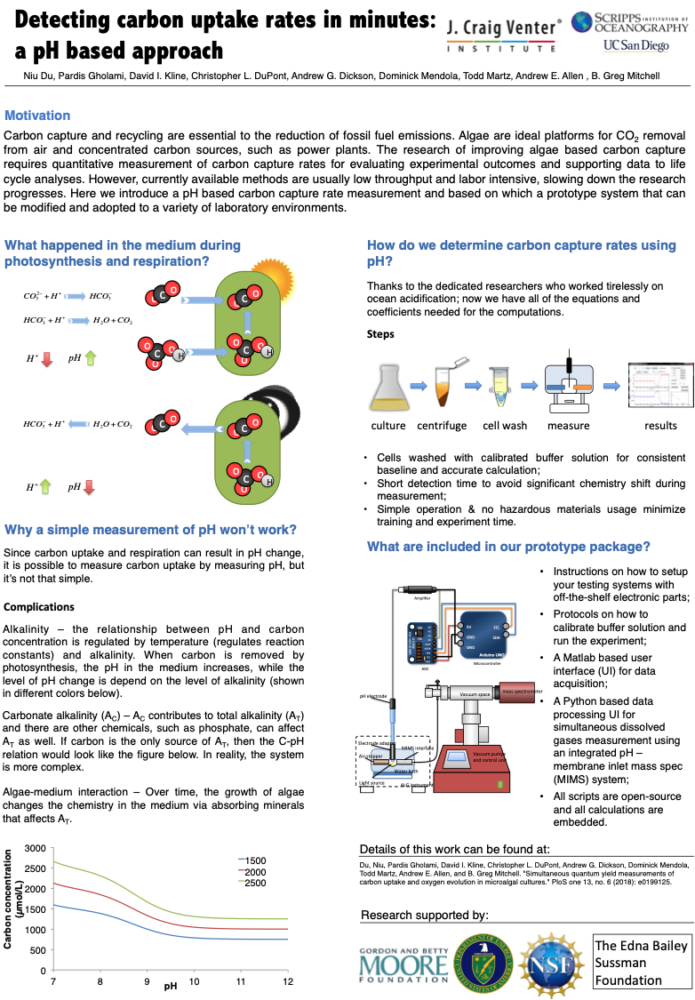

# pHOS
</img>

In order to run the system, the following setup should be implemented to meet the minimal requirement:

</img>
#### The pHOS apparatus for pH calibration, measurement and data logging.  
The configuration of nodes on the Arduino UNO controller was simplified to highlight the circuit connections. To improve the precision of pH measurement, the Arduino micro-controller must be plugged in with an independent power supply to avoid reference voltage fluctuation when powered only by the USB connection.

More details about the system can be found at:
https://journals.plos.org/plosone/article?id=10.1371/journal.pone.0199125
